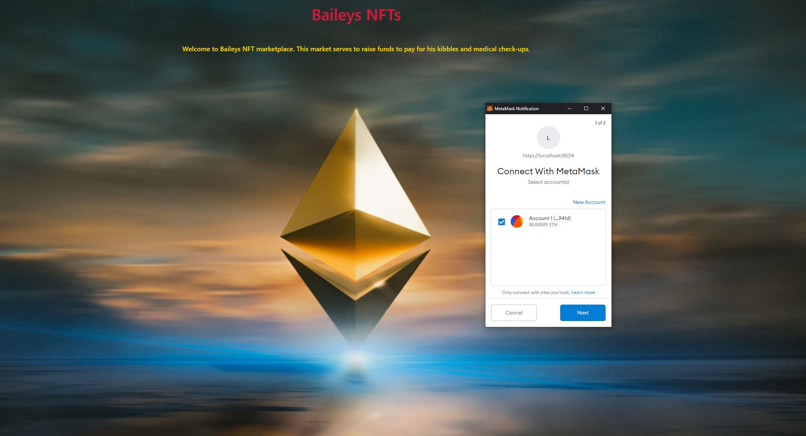

# LOSTt Bulls :ox:
#### Authored by: [Luke](https://github.com/lukekonsta7), [Oliver](https://github.com/OliverGeddes), [Scott](https://github.com/Bomegolf), [Tom](https://github.com/kez4twez), and [Thapa](https://github.com/TribThapa)

&nbsp;

## Project Overview
The aim of this project was to leverage Blockchain technology to: 

- Create a MarketPlace to buy-and-sell NFTs. 

&nbsp;

- Use [Moralis](https://moralis.io/?utm_source=youtubemoralis&utm_medium=video&utm_campaign=XOvtnDx1m5c) to create a DEX to swap cryptocurrency.

&nbsp;

- Create a [website](https://htmlpreview.github.io/?https://github.com/TribThapa/NFTs/blob/main/website/index.html) to serve as the landing page.
