# LOSTt Bulls :ox:
#### Authored by: [Luke](https://github.com/lukekonsta7), [Oliver](https://github.com/OliverGeddes), [Scott](https://github.com/Bomegolf), [Tom](https://github.com/kez4twez), and [Thapa](https://github.com/TribThapa)

&nbsp;

# Project Overview
Our project aimed to create Flex Dex to provide a simple user friendly way to swap coins.

&nbsp;

## The images below highlight steps involved in creating and launching Flex Dex

Geneterated a Moralis Server

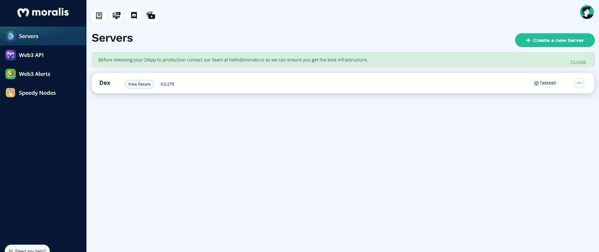

Add Moralis.io plugins

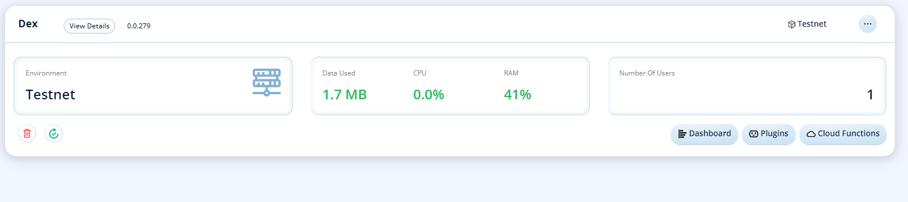

## Installed 1inch Plugin

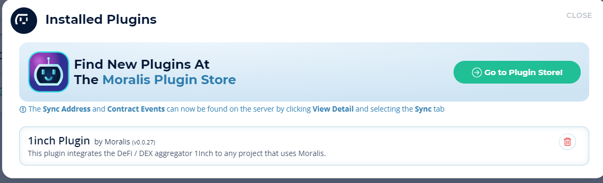

## Connect Server to Dapp Mainjs

Copy Server URL:

Copy Appilcation ID:

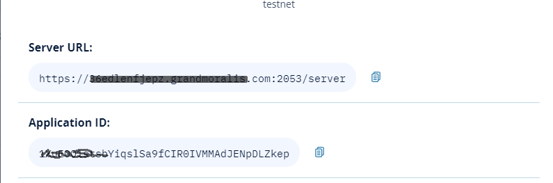

## Encrypt Url and Application ID into Mainjs

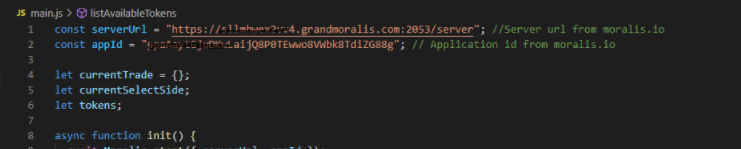

## Coding Mainjs for Dapp

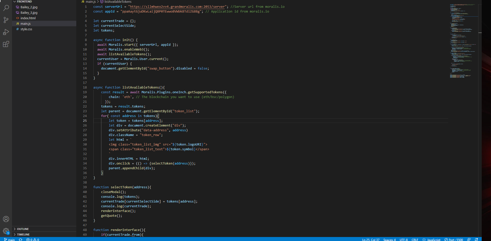

## Coding htmljs for Flex Dex coin swap

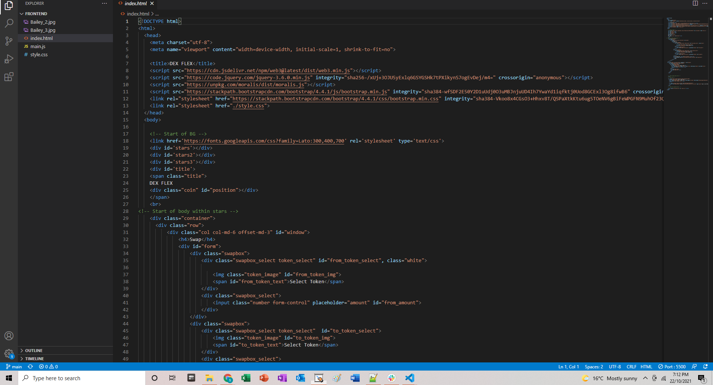

## Coding Style CCS to create front end interface for Flex Dex

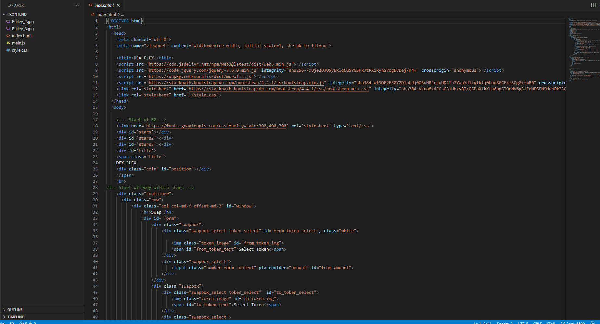

# Deploying Flex Dex

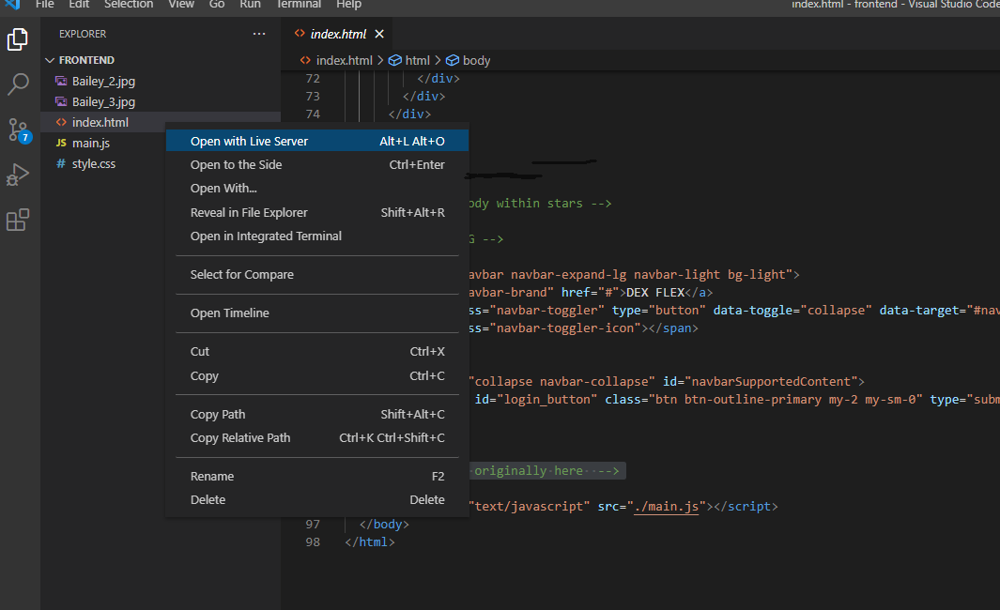

## Connect to Metamask

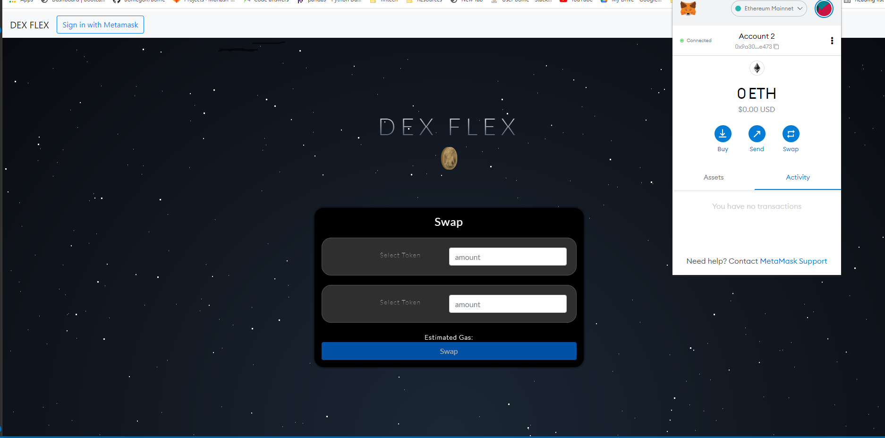

## Select Coins

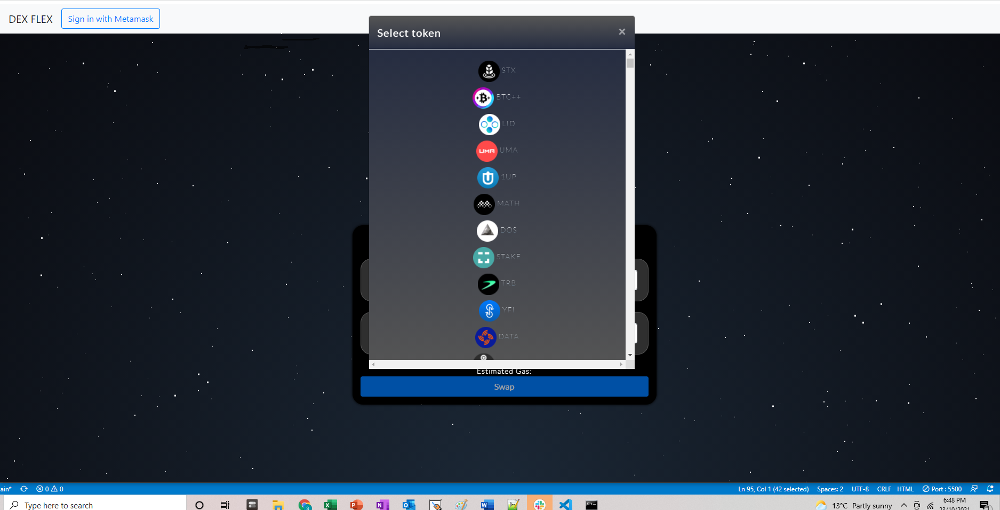

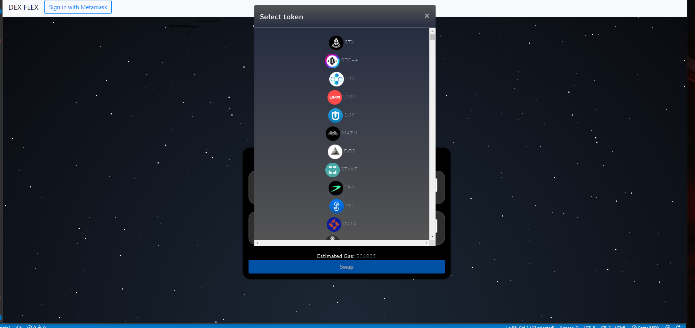

## Price Conversion

## Confirm Transcation

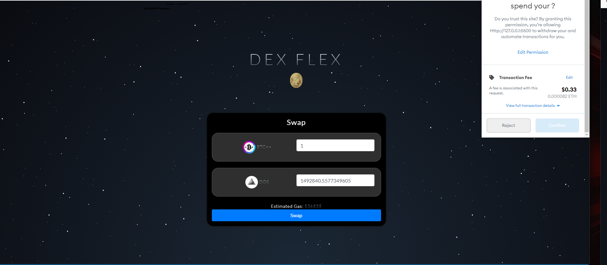

## Sources
- [DEX Tutorial](https://www.youtube.com/watch?v=XOvtnDx1m5c&ab_channel=MoralisWeb3)
- [Moralis](https://moralis.io/?utm_source=youtubemoralis&utm_medium=video&utm_campaign=XOvtnDx1m5c)
- [Repo](https://github.com/MoralisWeb3/demo-apps/tree/main/dex-tutorial)
- [PlugIns](https://moralis.io/plugins/)