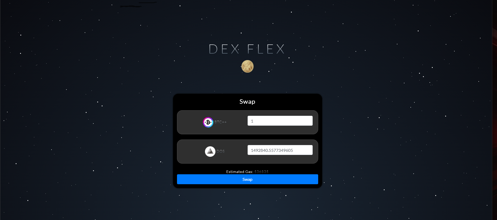

# LOSTt Bulls :ox:
#### Authored by: [Luke](https://github.com/lukekonsta7), [Oliver](https://github.com/OliverGeddes), [Scott](https://github.com/Bomegolf), [Tom](https://github.com/kez4twez), and [Thapa](https://github.com/TribThapa)

&nbsp;

# Project Overview
Our project aimed to create Flex Dex to provide a simple user friendly way to swap coins.

&nbsp;

## The images below highlight steps involved in creating and launching DexFlex

Geneterate a Moralis Server

Add Moralis.io plugins

## Install 1inch Plugin

## Connect Server to Dapp Mainjs

Copy Server URL:

Copy Appilcation ID:

## Encrypt Url and Application ID into main.js

## Example of main.js file for DexFlex

## Code index.html for DexFlex to swap coins

## Code style.css to create front end interface for DexFlex

## Deploy DexFlex

## Connect to Metamask

## Select Coins

&nbsp;

## Check valeu of one coin for another

## Confirm decentralised exchange

&nbsp;

## Sources
- [DEX Tutorial](https://www.youtube.com/watch?v=XOvtnDx1m5c&ab_channel=MoralisWeb3)
- [Moralis](https://moralis.io/?utm_source=youtubemoralis&utm_medium=video&utm_campaign=XOvtnDx1m5c)
- [Repo](https://github.com/MoralisWeb3/demo-apps/tree/main/dex-tutorial)
- [PlugIns](https://moralis.io/plugins/)